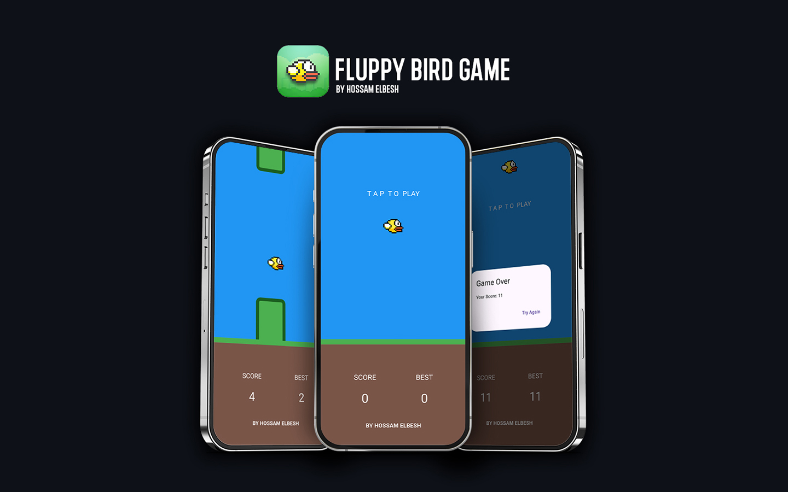

# Flappy Bird Game

This is a Flappy Bird-style game created with Flutter. Tap the screen to make the bird fly and avoid the barriers.

## Features

- **Tap-to-Fly**: The player taps to make the bird jump and avoid hitting barriers.
- **Score Tracking**: The game tracks and displays your current and best scores.
- **Game Over Dialog**: When the bird hits a barrier or falls, the game displays a score summary with a retry option.
- **Responsive Design**: The game adapts to different screen sizes and orientations.

## Getting Started

This project is a starting point for a Flutter application.

A few resources to get you started if this is your first Flutter project:

- [Lab: Write your first Flutter app](https://docs.flutter.dev/get-started/codelab)
- [Cookbook: Useful Flutter samples](https://docs.flutter.dev/cookbook)

For help getting started with Flutter development, view the
[online documentation](https://docs.flutter.dev/), which offers tutorials,
samples, guidance on mobile development, and a full API reference.
